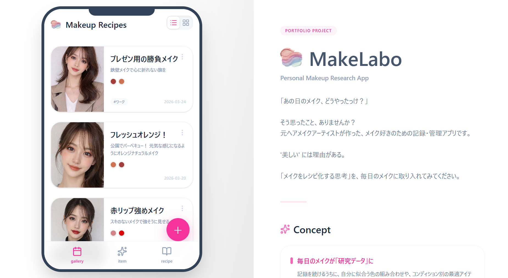
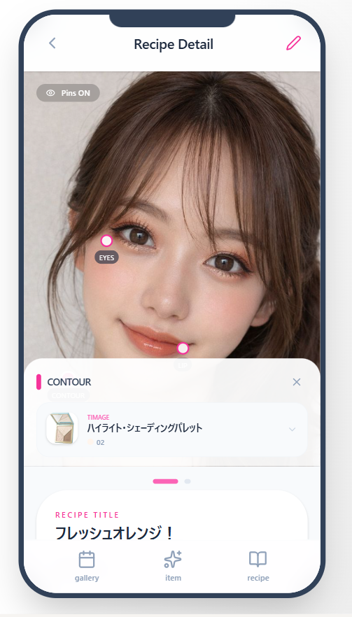
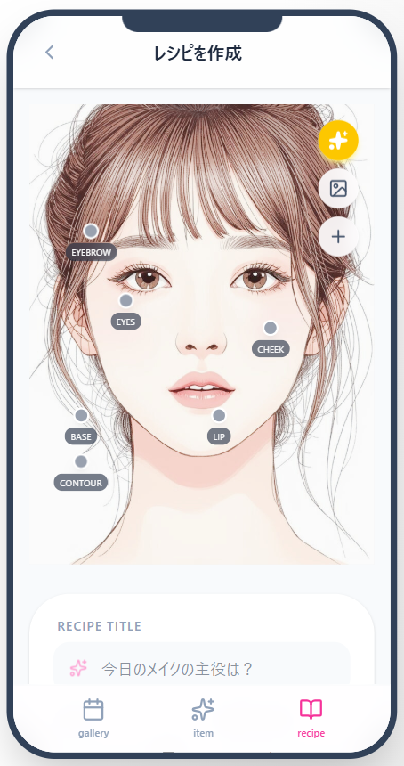
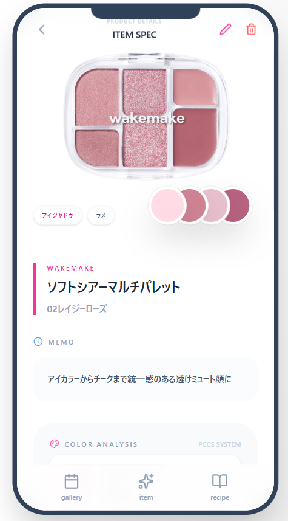

# MakeLabo

メイク好きのための記録・管理Webアプリ。
「なんとなく」になりがちな毎日のメイクを詳細にレシピ化し、再現性と色彩感覚を高めるためのプラットフォームです。

🔗 **[アプリを見る](https://main.d2jqhenkd2g20n.amplifyapp.com/)**  
※ ご確認いただきやすいよう、**ユーザー登録・ログイン不要ですぐに全機能をお試しいただける**ゲストモード（共通テストアカウントへの自動接続）として公開しています。

---

## UI プレビュー



| メイクレシピ詳細 | メイクレシピ追加 | コスメ管理 |
|:-:|:-:|:-:|
|  |  |  |

---


##  主な機能

- **📍 ピン留めでメイクをレシピ化**
  顔のイラストや写真に対して使用アイテムをピン留めし、「どこに・どう塗ったか」を工程ごとに記録。

- **🎨 PCCS色彩理論による色自動判定**
  コスメの色（カラーコード）を独自のアルゴリズムで解析し、トーン・色相で自動分類。「青みピンク」「ディープトーン」など、直感的な色の言葉で理解を深めます。

- **📊 カラーチップによる視覚化**
  その日使った色をチップとして一覧表示。「なんかまとまりがあったな」「今日はコントラストが強かったな」という印象を、感覚ではなくデータ（色）として確認できます。

- **👗 フリーピン（全身トータルコーデ記録）**
  服やアクセサリーなど、コスメ以外のアイテムもキャンバスに記録可能。トータルコーディネートとしてのメイクを保存できます。

- **🛍 所有コスメの傾向分析**
  カテゴリ別に整理できるのはもちろん、所有コスメの色の傾向をカラーチップ表示で一目で把握。「似た色ばかり買ってしまう」を防ぎ、次の購入の根拠を生み出します。

---

##  技術スタック

### Frontend
- **React (Vite) / TypeScript**: コンポーネントの再利用による開発効率の向上と、型安全なコードによるバグ予防のために採用しました。
- **TailwindCSS**: モバイルファーストでのレスポンシブ設計をスムーズに行うために導入し、グラスモーフィズムを取り入れたUIを構築しました。
- **React Router**: クライアントサードルーティングにより、ページ遷移がサクサク進むSPA（シングルページアプリケーション）を実現しています。

### Backend & API
- **FastAPI (Python)**: パフォーマンスに優れた非同期フレームワークを採用し、RESTful APIを構築しました。
- **SQLAlchemy / MySQL**: データベース操作を安全に行うためORMを利用しています。本番環境のデータベースとしてAmazon RDS（MySQL）を採用し、堅牢なデータ管理を実現しています。
- **Pydantic**: クライアントから送られてくるデータの型チェック（バリデーション）を厳密に行い、安全性を高めています。
- **JWT認証**: パスワードのハッシュ化（Bcrypt）とトークンを利用し、セキュアなログイン機能を実装しました。

### インフラストラクチャ・サーバー（AWS）
- **AWS Amplify**: フロントエンドの公開に使用。GitHubへのプッシュと連動して自動で本番環境に反映される構成（CI/CD）を組んでいます。
- **Elastic Beanstalk**: バックエンドAPIを安定して動かすためのサーバー環境として構築しました。
- **Amazon RDS**: フルマネージドなリレーショナルデータベース（MySQL）を採用し、可用性とスケーラビリティの高いデータ基盤を構築しました。
- **CloudFront**: フロントエンドとバックエンド間で発生する通信の制約（HTTPS/HTTPの混在によるエラー）を回避するためのプロキシとして利用しています。

---

##  技術的な工夫・アピールポイント

### 1. 「色彩理論」を取り入れた独自のカラー判定ロジック
単にユーザーが色を登録するだけでなく、「青みピンク」「ディープトーン」といったPCCS（日本色研配色体系）に基づく言葉に自動変換するロジックをPythonで実装しました。メイクの色合いを「感覚」ではなく「言葉」で体系的に振り返ることができる体験にこだわりました。

### 2. コンセプトを伝えるPC閲覧用レスポンシブデザイン
本アプリはスマートフォンでの利用を想定したモバイルファースト設計ですが、採用担当者様にPCで閲覧していただく機会が多いと考えました。そこで、PCで開いた際には「左側のスマホ枠にアプリを表示し、右側にコンセプト説明を配置する」という特別な2カラムレイアウトを自作し、アプリの魅力がすぐに伝わるよう工夫しました。

### 3. デプロイ環境における通信エラー（Mixed Content）の解決
開発段階では問題なかったものの、AWSへデプロイした際に「HTTPSのフロントエンドからHTTPのAPIを呼び出せない」というMixed Contentエラーに直面しました。これを解決するため、AWS CloudFrontをAPIの手前に配置してSSL化するインフラ構成を自力で構築しました。

### 4. SPAにおけるネイティブアプリのような体験（UX）への配慮
React Routerでの画面遷移時に「スクロール位置が残ってしまう」というSPA特有の課題に気づき、ページ遷移ごとにメインコンポーネントのスクロールを一番上へリセットするフックを実装しました。Webブラウザ上でも本物のスマホアプリのような自然な操作感を追求しています。

---

## 今後の展望（ロードマップ）

本アプリは、単なる個人向けのメイク記録アプリにとどまらず、将来的には「プロのヘアメイクアップアーティストが、顧客ごとの施術履歴や提案内容を管理するデジタルカルテ」として活用いただけるシステムへと拡張することを見据えています。そのためのステップとして、以下のような機能追加を計画しています。

- **高度な検索・フィルタリング機能**
  「トーン」や「色相」などのカラーデータを用いて、特定の条件に合致する過去のメイクレシピやコスメを瞬時に絞り込んで探せる機能。

- **使用傾向の分析・グラフ化**
  蓄積されたデータをグラフで可視化し、「自分がよく使う色の傾向」や「季節ごとのメイクの変化」を直感的に分析できるダッシュボード機能の実装。
  
- **SNS・レシピ共有機能**
  自分が作ったこだわりのメイクレシピを公開したり、他ユーザー（プロのアーティスト含む）が作った魅力的なレシピを閲覧・保存・共有できるコミュニティ機能の構築。

---

## 開発ツール・環境

- バージョン管理: Git / GitHub
- AIアシスタント: Claude / Anthropic / Google Gemini (Antigravity Protocol) を活用したペアプログラミングによる高速開発

## 画面遷移図
ユーザーが迷わずに色彩診断から保存、管理まで行えるよう、直感的な動線を意識して設計しました。

```mermaid
flowchart TD
    %% Base styles
    classDef default fill:#fff,stroke:#cbd5e1,stroke-width:2px,color:#334155;
    classDef mainNav fill:#fdf2f8,stroke:#f472b6,stroke-width:2px,color:#be185d,font-weight:bold;
    classDef subPage fill:#f8fafc,stroke:#94a3b8,stroke-width:1px,color:#475569;

    %% Bottom Navigation
    BottomNav{{ボトムナビゲーション<br/>(全画面共通配置)}}

    %% Main Pages (Bottom Nav Links)
    NavH["🏠 ギャラリー<br/>( / )"]:::mainNav
    NavC["✨ コスメ一覧<br/>( /cosme )"]:::mainNav
    NavP["📖 レシピ登録<br/>( /post )"]:::mainNav

    BottomNav -.-> NavH
    BottomNav -.-> NavC
    BottomNav -.-> NavP

    %% Child Pages
    RecipeDetail["📋 レシピ詳細<br/>( /recipe/:id )"]:::subPage
    CosmeDetail["🏷️ コスメ詳細<br/>( /cosme/:id )"]:::subPage
    CosmeReg["➕ コスメ追加<br/>( /cosme/new )"]:::subPage
    Readme["ℹ️ アプリ説明<br/>( /readme )"]:::subPage

    %% Transitions from Gallery (History)
    NavH -->|レシピ選択| RecipeDetail
    NavH -->|レシピ編集/追加| NavP
    NavH -->|説明を見る| Readme

    %% Transitions from CosmeList
    NavC -->|コスメ選択| CosmeDetail
    NavC -->|新規登録| CosmeReg

    %% Back Transitions (Return)
    RecipeDetail -.->|戻る| NavH
    Readme -.->|戻る| NavH
    CosmeDetail -.->|戻る| NavC
    CosmeReg -.->|完了/戻る| NavC
    NavP -.->|完了/戻る| NavH
