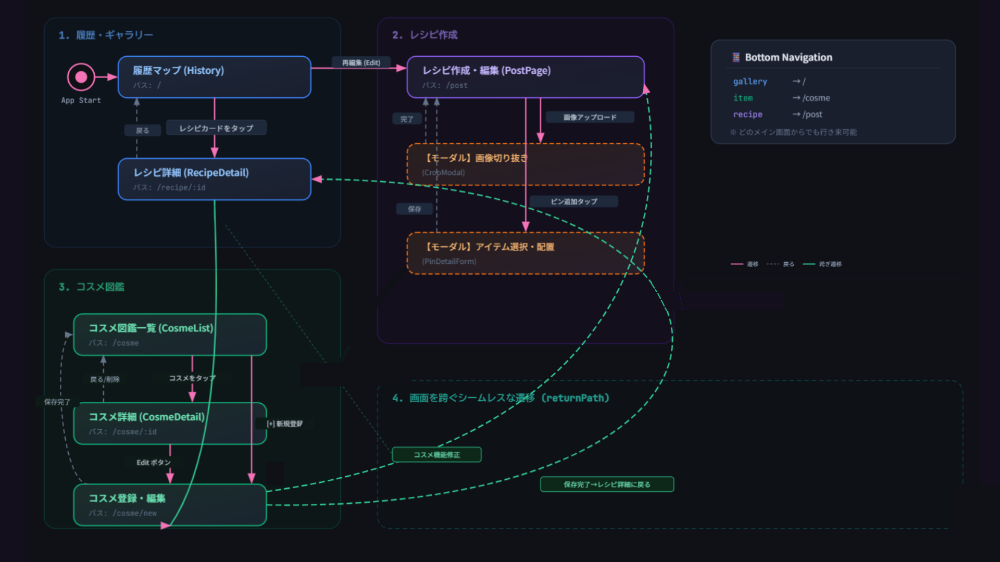

# MakeLabo

メイク好きのための記録・管理Webアプリ。
「なんとなく」になりがちな毎日のメイクを詳細にレシピ化し、再現性と色彩感覚を高めるためのプラットフォームです。

🔗 **[アプリを見る](https://main.d2jqhenkd2g20n.amplifyapp.com/)**  
※ ご確認いただきやすいよう、**ユーザー登録・ログイン不要ですぐに全機能をお試しいただける**ゲストモード（共通テストアカウントへの自動接続）として公開しています。

---

## UI プレビュー

| メイクレシピ詳細 | メイクレシピ追加 | コスメ管理 |
|:-:|:-:|:-:|
|  |  |  |

※レシピ登録に使用している人物画像はAI生成です

---

##  主な機能

📍 <b>ピン留めでメイクをレシピ化</b>

顔のイラストや写真に対して使用アイテムをピン留めし、「どこに・どう塗ったか」を工程ごとに記録。

 

🎨 <b>PCCS色彩理論による色自動判定</b>

コスメの色（カラーコード）を独自のアルゴリズムで解析し、トーン・色相で自動分類。「青みピンク」「ディープトーン」など、直感的な色の言葉で理解を深めます。

 

📊 <b>カラーチップによる視覚化</b>

その日使った色をチップとして一覧表示。「なんかまとまりがあったな」「今日はコントラストが強かったな」という印象を、感覚ではなくデータ（色）として確認できます。

 

👗 <b>フリーピン（全身トータルコーデ記録）</b>

服やアクセサリーなど、コスメ以外のアイテムもキャンバスに記録可能。トータルコーディネートとしてのメイクを保存できます。

 

🛍 <b>所有コスメの傾向分析</b>

カテゴリ別に整理できるのはもちろん、所有コスメの色の傾向をカラーチップ表示で一目で把握。「似た色ばかり買ってしまう」を防ぎ、次の購入の根拠を明確にします。

---
## 画面遷移図
ユーザーが迷わずに色彩診断から保存、管理まで行えるよう、直感的な動線を意識して設計しました。 
※ ご確認いただきやすいよう、ユーザー登録・ログイン不要ですぐに全機能をお試しいただけるゲストモード（共通テストアカウントへの自動接続）として公開しています。

---

##  技術スタック

### Frontend
- **React (Vite) / TypeScript**: コンポーネントの再利用による開発効率の向上と、型安全なコードによるバグ予防のために採用しました。
- **TailwindCSS**: モバイルファーストでのレスポンシブ設計をスムーズに行うために導入しました。
- **React Router**: ブラウザ側で画面の切り替えを制御する「クライアントサイドルーティング」を採用。ページ移動のたびにサーバーと通信して画面全体を読み込み直す必要がないため、アプリのようなサクサクとした操作感を実現しています。

### Backend & API
- **FastAPI (Python)**: パフォーマンスに優れた非同期フレームワークを採用し、RESTful APIを構築しました。
- **SQLAlchemy / PostgreSQL**: データベース操作を安全に行うためORMを利用しています。本番環境のデータベースとしてSupabase（PostgreSQL）を採用し、低コストかつ可用性の高いデータ管理を実現しています。
- **Pydantic**: クライアントから送られてくるデータの型チェック（バリデーション）を厳密に行い、安全性を高めています。
- **JWT認証**: パスワードのハッシュ化（Bcrypt）とトークンを利用し、セキュアなログイン機能を実装しました。

### インフラストラクチャ・サーバー（AWS）
- **AWS Amplify**: フロントエンドの公開に使用。GitHubへのプッシュと連動して自動で本番環境に反映される構成（CI/CD）を組んでいます。
- **Elastic Beanstalk (EC2単一インスタンス)**: バックエンドAPIを低コストかつ安定して動かすためのサーバー環境として構築しました。
- **Supabase**: フルマネージドなデータベース（SaaS PostgreSQL）を採用し、AWSの維持費を抑えながら可用性とデータ保護を両立しています。
- **CloudFront**: フロントエンドとバックエンド間で発生する通信の制約（HTTPS/HTTPの混在によるエラー）を回避するためのプロキシとして利用しています。

---

##  技術的な工夫・アピールポイント

### 1. 「色彩理論」を取り入れた独自のカラー判定ロジック
単にユーザーが色を登録するだけでなく、「青みの赤」「ディープトーン」といったPCCS（日本色研配色体系）に基づく言葉に自動変換するロジックをPythonで実装しました。メイクの色合いを「感覚」だけではなく「言葉」で体系的に振り返ることができる体験にこだわりました。

### 2. コンセプトを伝えるPC閲覧用レスポンシブデザイン
本アプリはスマートフォンでの利用を想定したモバイルファースト設計ですが、採用担当者様にPCで閲覧していただく機会が多いと考えました。そこで、PCで開いた際には「左側のスマホ枠にアプリを表示し、右側にコンセプト説明を配置する」という特別な2カラムレイアウトを自作し、アプリの魅力がすぐに伝わるよう工夫しました。

### 3. デプロイ環境における通信エラー（Mixed Content）の解決
開発段階では問題なかったものの、AWSへデプロイした際に「HTTPSのフロントエンドからHTTPのAPIを呼び出せない」というMixed Contentエラーに直面しました。これを解決するため、AWS CloudFrontをAPIの手前に配置してSSL化するインフラ構成を構築しました。

### 4. SPAにおけるネイティブアプリのような体験（UX）への配慮
React Routerを用いたSPA開発において、遷移後のスクロール位置が保持されてしまう課題を解決するため、遷移ごとにスクロール位置をトップにリセットするカスタムフックを実装しました。Webブラウザ特有の挙動を制御し、ネイティブアプリのような自然な操作感を追求しました。

### 5. データベースの分離とクラウドSaaSを活用したコスト最適化
当初はアプリケーションサーバー内蔵のDBを使用していましたが、デプロイのたびにデータが初期化される課題がありました。これを解消するため、外部データベースである「Supabase（PostgreSQL）」を導入しDBをサーバーから完全分離。AWSの高額なRDSやロードバランサーをあえて使わず、無料SaaSと単一インスタンスを組み合わせることで、**「可用性・データの永続化」と「月額維持費の極小化（約10ドル/月）」を両立したポートフォリオ最適構成**を実現しました。

---

## 今後の展望（ロードマップ）

本アプリは、単なる個人向けのメイク記録アプリにとどまらず、将来的には「プロのヘアメイクアップアーティストが、顧客ごとの施術履歴や提案内容を管理するデジタルカルテ」として活用いただけるシステムへと拡張することを見据えています。そのためのステップとして、以下のような機能追加を計画しています。

- **高度な検索・フィルタリング機能**
  「トーン」や「色相」などのカラーデータを用いて、特定の条件に合致する過去のメイクレシピやコスメを瞬時に絞り込んで探せる機能。

- **使用傾向の分析・グラフ化**
  蓄積されたデータをグラフで可視化し、「自分がよく使う色の傾向」や「季節ごとのメイクの変化」を直感的に分析できるダッシュボード機能の実装。
  
- **SNS・レシピ共有機能**
  自分が作ったこだわりのメイクレシピを公開したり、他ユーザー（プロのアーティスト含む）が作った魅力的なレシピを閲覧・保存・共有できるコミュニティ機能の構築。

---

## 開発ツール・環境

- バージョン管理: Git / GitHub
- AIアシスタント: Claude / Anthropic / Google Gemini (Antigravity Protocol) を活用したペアプログラミングによる高速開発
